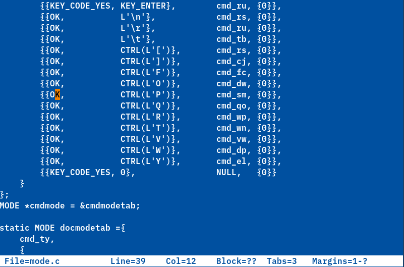
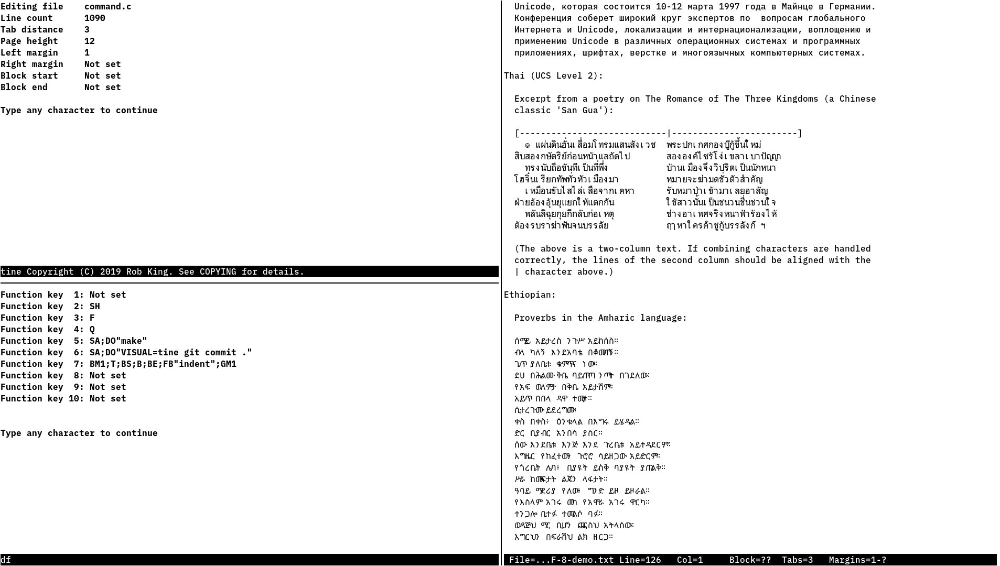

# tine - tine is not ED

## Introduction
tine (pronouced "tiny" and standing for "tine Is Not ED") is a modern-day
clone of the AmigaDOS/TRIPOS ED display editor.

ED was originally written by MetaComCo in the early 1980's as a display
editor for the TRIPOS operating system. MetaComCo later ported TRIPOS
to the Amiga, where it formed the core of AmigaDOS; as part of this
port, ED was included as a display editor.

ED was shipped as part of every release of AmigaDOS, from 1.0 to the latest
4.x series. It stands as the standard display editor for the operating
system (in other words, "ED is the standard text editor").

(Note that tine is not endorsed by any owners of the Amiga intellectual property,
MetaComCo, or anyone else.)

## Differences from ED
tine is more than just an implementation of ED's extended command language,
or a set of key-bindings on top of some other editor.
tine attempts to be faithful to ED's somewhat unusual handling of whitespace and tabs,
it's rather anachronistic cursor position handling (in some ways ED feels more like a
typewriter than a display editor), its simplicity, and its general quirkiness.

In other words, tine tries to function as similarly to ED as possible,
but there are a few differences:

**The Good**
- Unlimited line length (ED limits lines to 255 characters)
- Full extended command editing and history (ED has only insert-and-delete-at-the-end
  editing for extended commands, and no history)
- Smooth horizontal scrolling (ED only has chunky horizontal scrolling)
- Unlimited undo (ED only has undo within the current line)
- Numerous additional extended commands
- A status line (ED has no status line of any kind, and in fact it's not actually possible to tell what line number you're on in ED except by counting from the top)
- Much improved tab handling (ED does not allow the insertion of literal tabs)
- Support for wide characters and combining characters (ED supports neither)
- Up to ten bookmarks (there are no bookmarks in ED)
- Various quality-of-life improvements (e.g. specifying a block start after a block end still works)

**The Less Good**
- Being a console-only application, tine does not support ED's extended menus or
  mouse-based cursor movement, similar to the pre-AmigaDOS 2 versions
- Much like versions of ED shipped prior to AmigaDOS 2, tine does not support
  REXX macros

All-in-all, tine functions similarly to ED circa AmigaDOS 1.3, with some features from
AmigaDOS 2 and 3 and a few additional features. In any case, tine should be familiar and
comfortable to ED users familiar with any version of the editor.

## Screenshots
The font used in these screenshots is [IBM Plex](https://www.ibm.com/plex/),
which is the only font with a dotted zero that I've ever really liked.

### Shot 1

A screenshot of tine editing a complex program.

### Shot 2

Three instances of tine running under [mtm](https://github.com/deadpixi/mtm).

The instance on the top left is showing the output of the `SH` command,
while the isntance on the bottom left is showing the currently defined
function keys (i.e. the output of the `DF` command).

The instance on the right is editing text in multiple languages,
displaying combining characters and other interesting features.

## The Future

tine does not aim to be much more than an ED clone with a few improvements.
However, the following changes are planned:

- Removal of the ncurses dependency
- Multi-window editing
- Simple syntax highlighting
- Buffer and screen management is fairly simplistic (though, given the expected use cases, perfectly adequate);
  they will be improved in the future

## A Work in Progress

tine is very much a work in progress,
but it's been stable enough to be my daily driver for a while now.

Please report any bugs you may find, and patches would be happily accepted.
Note that, for the most part, differences in behavior from AmigaDOS ED are considered bugs,
so please report any that you may find.
